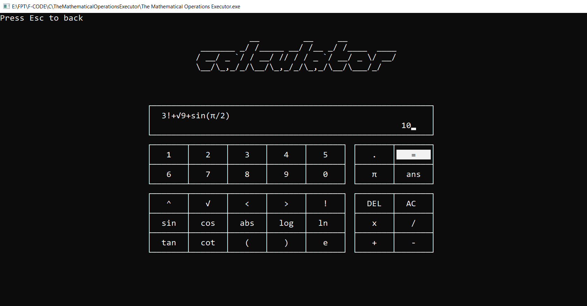
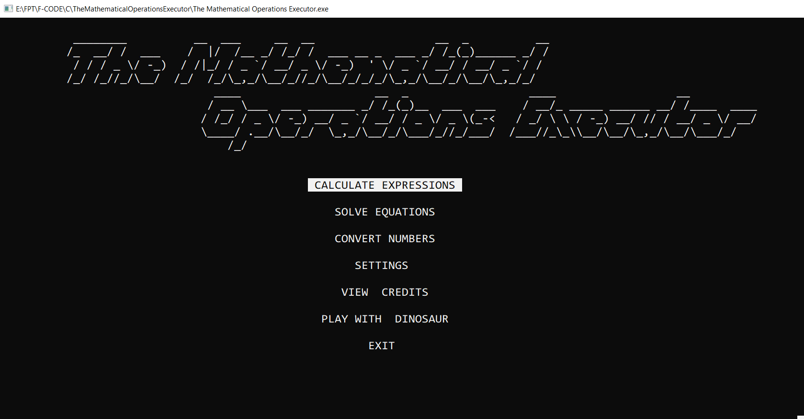
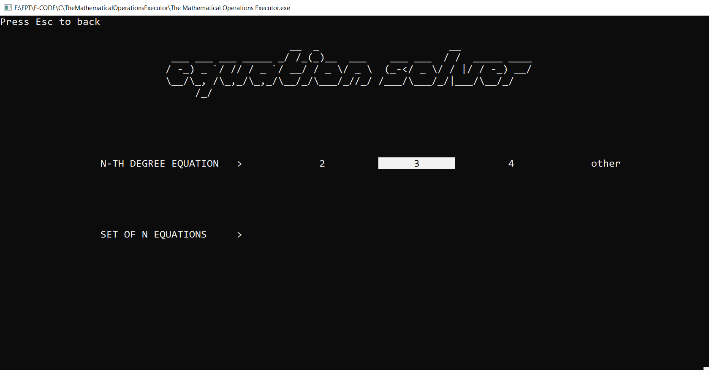
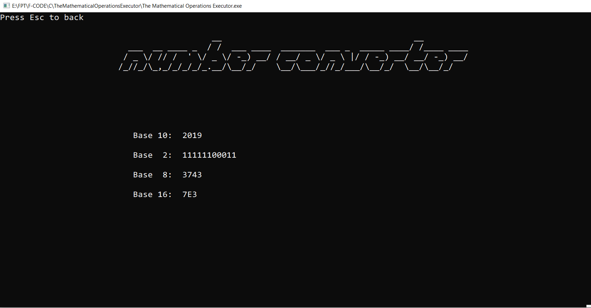
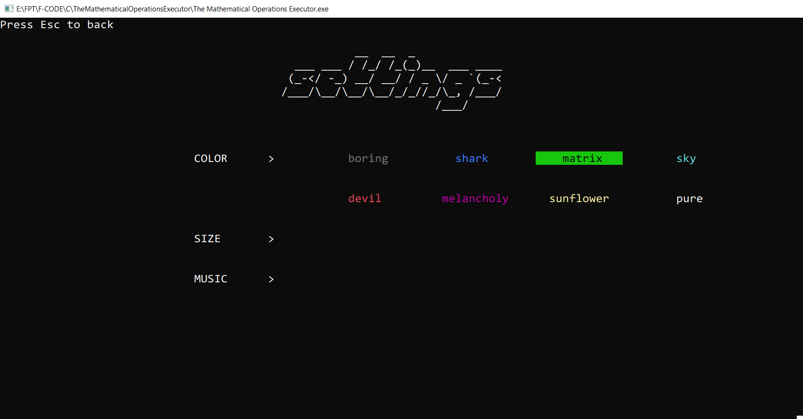
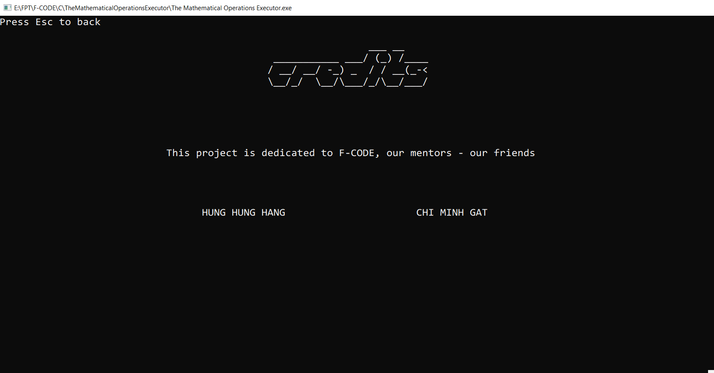
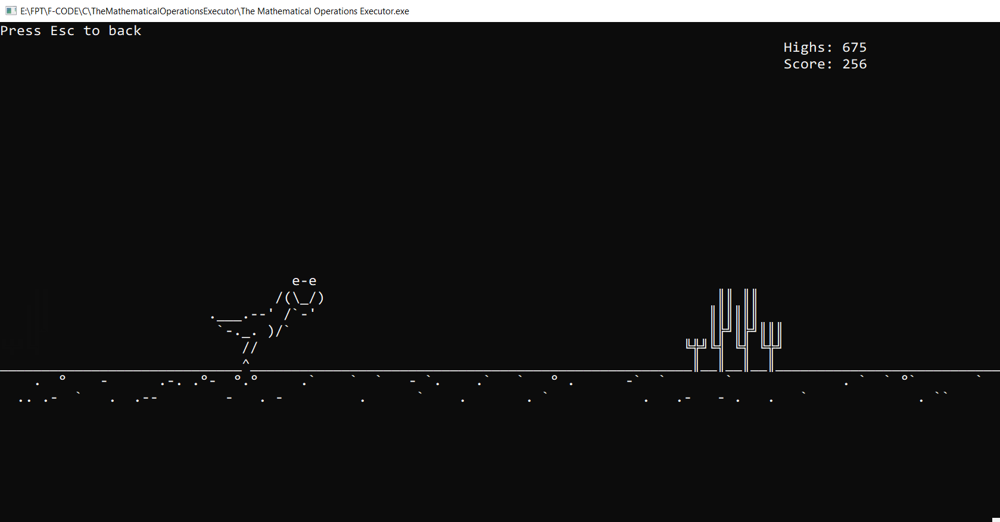

# The Mathematical Operations Executor (aka Calculator)
A console application with usable UI and navigation using arrow keys

# Features:
1. Math operations calculating
2. Equations solving:
	- N-th degree equation
	- Set of N equations
3. Base number converter (2, 8, 10, 16)
4. Dinosaur game

# Sreenshots:
## 1. Home menu

## 2. Calculator

## 3. Equation solver

## 4. Base converter

## 5. Settings

## 6. Credits

## 7. Dinosaur game

